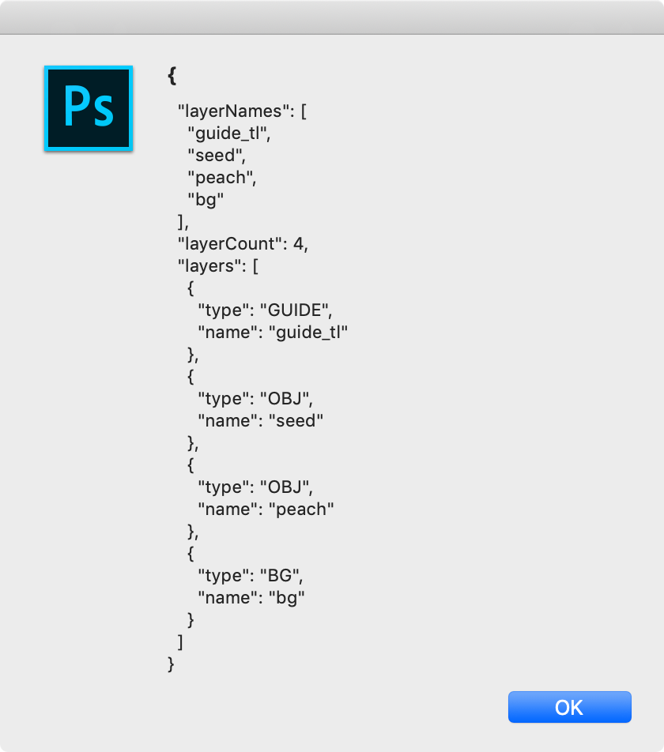
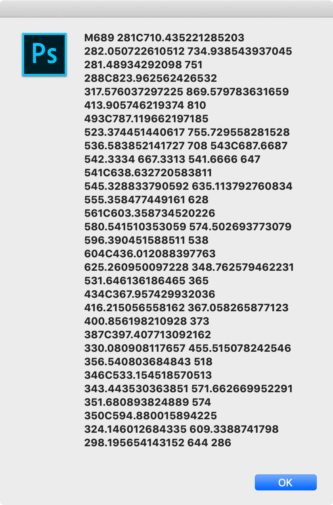
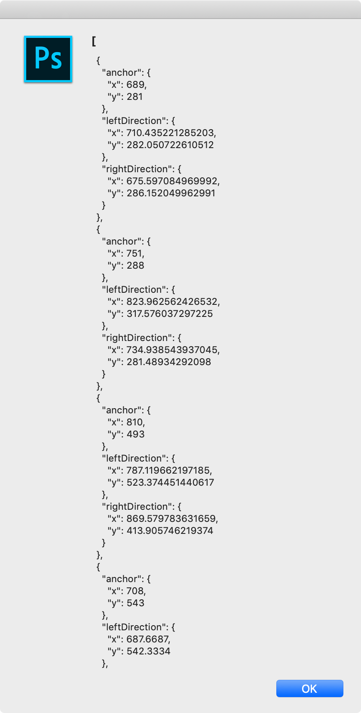

### storybook-photoshop-jsx

Photoshop scripts for managing storybook assets.

#### usage
The jsx folder contains scripts that can be opened in Photoshop via 

```
File->Scripts->Browse...
```

The example PSD file, `psd/peaches.psd` can be used to test the scripts.

#### get-layers.jsx
Gathers layer data into a json object. Run using:
```
do-get-layers.jsx
```


```js
var data = getLayerData();
alert(JSON.stringify(data, null, 2));
```



##### layer types
The *type* for each layer is determined by the first word (prefix word) in each layer's name. Layer names should be underscore-delimited. i.e. *bg_main* or *obj_peach*. If there is only one bg it can be named *bg*. Valid prefix words include:
- **fg** - FG (foreground) layer
- **guide** - GUIDE layer
Layers with the following prefixes are also treated as GUIDE layers
  - **tl**
  - **tr**
  - **bl**
  - **br**
- **bg** - BG (background) layer
- **obj** - OBJ (object) layer
Note: Layers without a prefix from the above list are treated as OBJ layers by default.

#### get-layer-path.jsx
Creates a new path (Work Path) that outlines the object on the specified layer. Run using:
```
do-get-layer-path.jsx
```


#### get-bounds.jsx
Gets the bounds (rectangle) of the current selection. Run using:
```
do-get-bounds.jsx
```


#### get-path-data.jsx
Gets the path data from the Work Path - both SVG path data and bezier path data. Run using:
```
do-get-path-data.jsx
```
**SVG Path Data**


**Bezier Path Data**


#### export-svg.jsx
Exports SVG Path Data as a standard SVG xml file to the same directory as the PSD. Run using:
```
do-export-svg.jsx
```


#### save-image.jsx
Saves the visible layers to a jpeg file in the same directory as the PSD. Makes GUIDE layers invisible first. Run using:
```
do-save-image.jsx
```


#### process-file.jsx
Uses all of the above scripts to:
- gather path data for all OBJECT layers
- export an SVG file for each OBJECT layer
- save all of the path data for all OBJECT layers to a json file
- save a jpeg image of all layers except GUIDE layers.

Run using:
```
do-process-file.jsx
```

#### do-storybook-palette.jsx
A non-modal (palette) window with buttons to invoke the above scripts can by run using:
```
do-storybook-palette.jsx
```


#### do-storybook-dialog.jsx
An alternative modal (dialog) window with buttons to invoke the above scripts can by run using:
```
do-storybook-dialog.jsx
```
