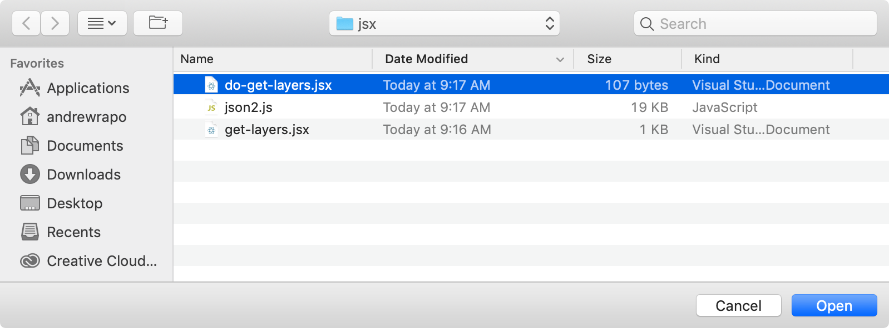
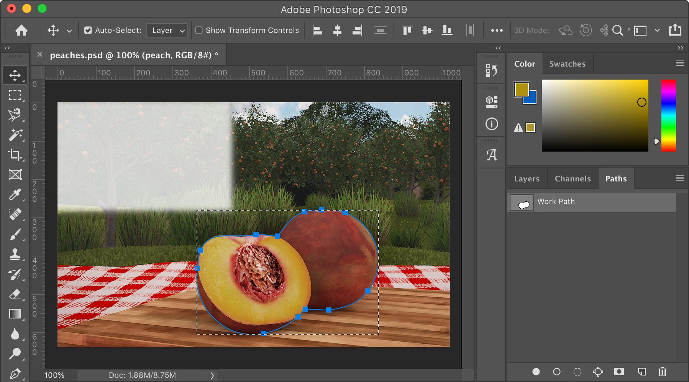
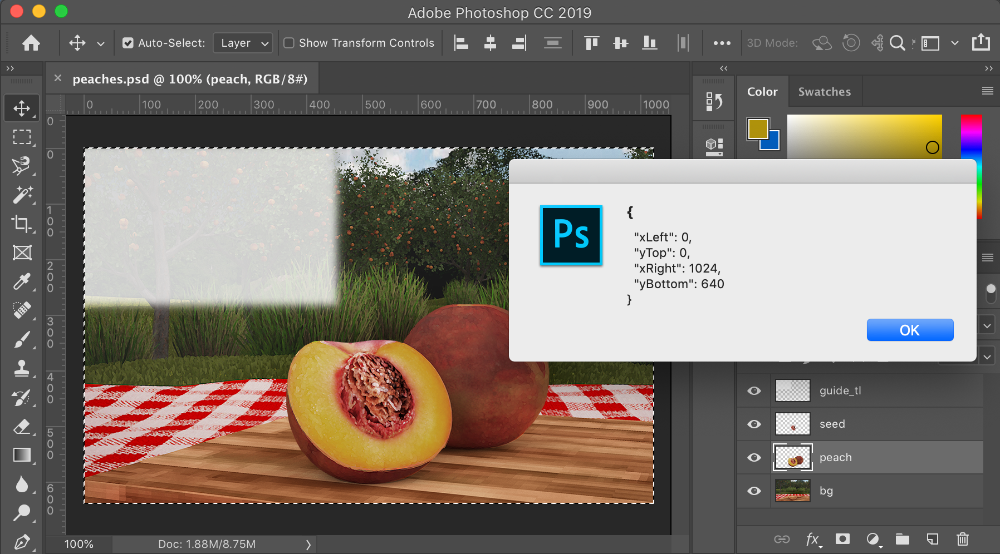
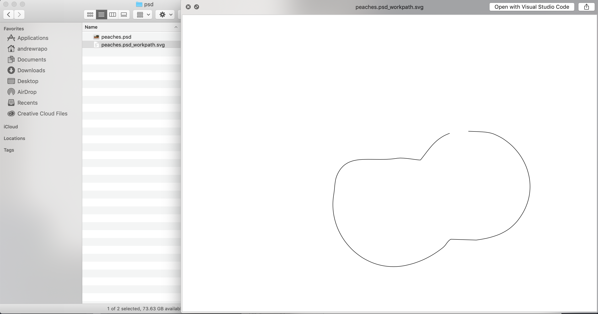
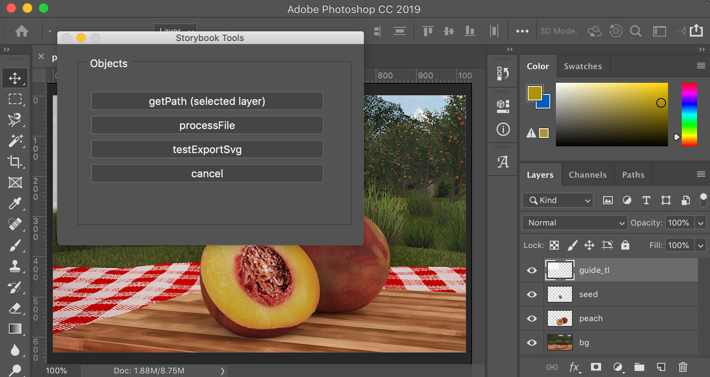
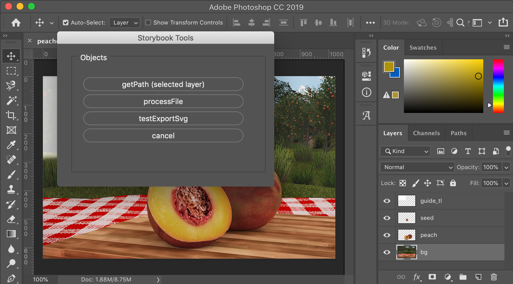

### storybook-photoshop-jsx

Photoshop scripts for managing storybook assets.

#### documentation
See this Medium article: [https://medium.com/@andrew.rapo/using-adobes-javascript-based-extendscript-jsx-to-automate-photoshop-workflow-tasks-f3b6690650d9](https://medium.com/@andrew.rapo/using-adobes-javascript-based-extendscript-jsx-to-automate-photoshop-workflow-tasks-f3b6690650d9)

#### usage
The jsx folder contains scripts that can be opened in Photoshop via 

```
File->Scripts->Browse...
```

The example PSD file, `psd/peaches.psd` can be used to test the scripts.

#### save-individual-layers.jsx
Saves each layer as PNG file. Run using:
```
do-save-individual-layers.jsx
```
You will be prompted to select a source folder and an output folder. For each source PSD file, a subfolder with the same name will be created and all layers in that PSD will be saved as PNGs in the new folder.

You might want to resize the photoshop files before saving individual layers, e.g., to import into a mobile app, etc. Preset files for resizing are inside the Preset folder.

See tutorial videos: [https://drive.google.com/drive/folders/1W2ljgBxpqlmHBrCjfnSGSVrA2zokWE8D?usp=sharing]


#### get-layers.jsx
Gathers layer data into a json object. Run using:
```
do-get-layers.jsx
```


```js
var data = getLayerData();
alert(JSON.stringify(data, null, 2));
```
The output looks like:
```
{
  "layerNames": [
    "guide_tl",
    "seed",
    "peach",
    "bg"
  ],
  "layerCount": 4,
  "layers": [
    {
      "type": "OBJ",
      "name": "guide_tl"
    },
    {
      "type": "OBJ",
      "name": "seed"
    },
    {
      "type": "TL",
      "name": "tl"
    },
    {
      "type": "BG",
      "name": "bg"
    }
  ]
}
```

##### layer types
The *type* for each layer is determined by the first word (prefix word) in each layer's name. Layer names should be underscore-delimited. i.e. *bg_main* or *obj_peach*. If there is only one bg it can be named *bg*. Valid prefix words include:
- **fg** - FG (foreground) layer
- **tl** - TL (top left) layer
- **tr** - TR (top right) layer
- **bl** - BL (bottom left) layer
- **br** - BR (bottom right) layer
- **bg** - BG (background) layer
- **obj** - OBJ (object) layer
Note: Layers without a prefix from the above list are treated as OBJ layers by default.

#### get-layer-path.jsx
Creates a new path (Work Path) that outlines the object on the specified layer. Run using:
```
do-get-layer-path.jsx
```



#### get-bounds.jsx
Gets the bounds (rectangle) of the current selection. Run using:
```
do-get-bounds.jsx
```


#### get-path-data.jsx
Gets the path data from the Work Path - both SVG path data and bezier path data. Run using:
```
do-get-path-data.jsx
```
**SVG Path Data**
```
M689 281C710.435221285203 282.050722610512 734.938543937045 281.48934292098 751 288C823.962562426532 317.576037297225 869.579783631659 413.905746219374 810 493C787.119662197185 523.374451440617 755.729558281528 536.583852141727 708 543C687.6687 542.3334 667.3313 541.6666 647 541C638.632720583811 545.328833790592 635.113792760834 555.358477449161 628 561C603.358734520226 580.541510353059 574.502693773079 596.390451588511 538 604C436.012088397763 625.260950097228 348.762579462231 531.646136186465 365 434C367.957429932036 416.215056558162 367.058265877123 400.856198210928 373 387C397.407713092162 330.080908117657 455.515078242546 356.540803684843 518 346C533.154518570513 343.443530363851 571.662669952291 351.680893824889 574 350C594.880015894225 324.146012684335 609.3388741798 298.195654143152 644 286
```

**Bezier Path Data**
```
[
  {
    "anchor": {
      "x": 689,
      "y": 281
    },
    "leftDirection": {
      "x": 710.435221285203,
      "y": 282.050722610512
    },
    "rightDirection": {
      "x": 675.597084969992,
      "y": 286.152049962991
    }
  },
...

  {
    "anchor": {
      "x": 644,
      "y": 286
    },
    "leftDirection": {
      "x": 655.968336099604,
      "y": 281.788893629799
    },
    "rightDirection": {
      "x": 609.3388741798,
      "y": 298.195654143152
    }
  }
]
```

#### export-svg.jsx
Exports SVG Path Data as a standard SVG xml file to the same directory as the PSD. Run using:
```
do-export-svg.jsx
```


#### save-image.jsx
Saves the visible layers to a jpeg file in the same directory as the PSD. Makes GUIDE layers invisible first. Run using:
```
do-save-image.jsx
```


#### process-file.jsx
Uses all of the above scripts to:
- gather path data for all OBJECT layers
- export an SVG file for each OBJECT layer
- save all of the path data for all OBJECT layers to a json file
- save a jpeg image of all layers except GUIDE layers.

Run using:
```
do-process-file.jsx
```

#### get-bezier-path.jsx and save-background-image.jsx
Both scripts work on psd files that are nested within two folders (ex: to process `psd/story_1/peaches.psd`, run the scripts on `psd`).

See [this guide](https://drive.google.com/open?id=1svSABg5kawoEDMn6g_IadOfPKMZZO90b) for how to use these scripts.

##### get-bezier-path.jsx
Saves bezier path data and seperates results into new subfolders according to the original subfolders.  For example, if run on `psd` where `psd` contains `psd/story_1/peaches.psd`, the resulting bezier path data will be in `psd/story_1_json/peaches.json`.  Can be run using:
```
do-get-bezier-path.jsx
```

##### save-background-image.jsx
Hides FG and OBJ layers before it saves the visible layers to a jpg and seperates results into new subfolders according to the original subfolders.  For example, if run on `psd` where `psd` contains `psd/story_1/peaches.psd`, the resulting jpg will be in `psd/story_1_jpg/peaches.jpg`.  Can be run using:
```
do-save-background-image.jsx
```

#### do-storybook-palette.jsx
A non-modal (palette) window with buttons to invoke the above scripts can by run using:
```
do-storybook-palette.jsx
```


#### do-storybook-dialog.jsx
An alternative modal (dialog) window with buttons to invoke the above scripts, except `get-bezier-path.jsx` and `save-background-image.jsx`, can by run using:
```
do-storybook-dialog.jsx
```



